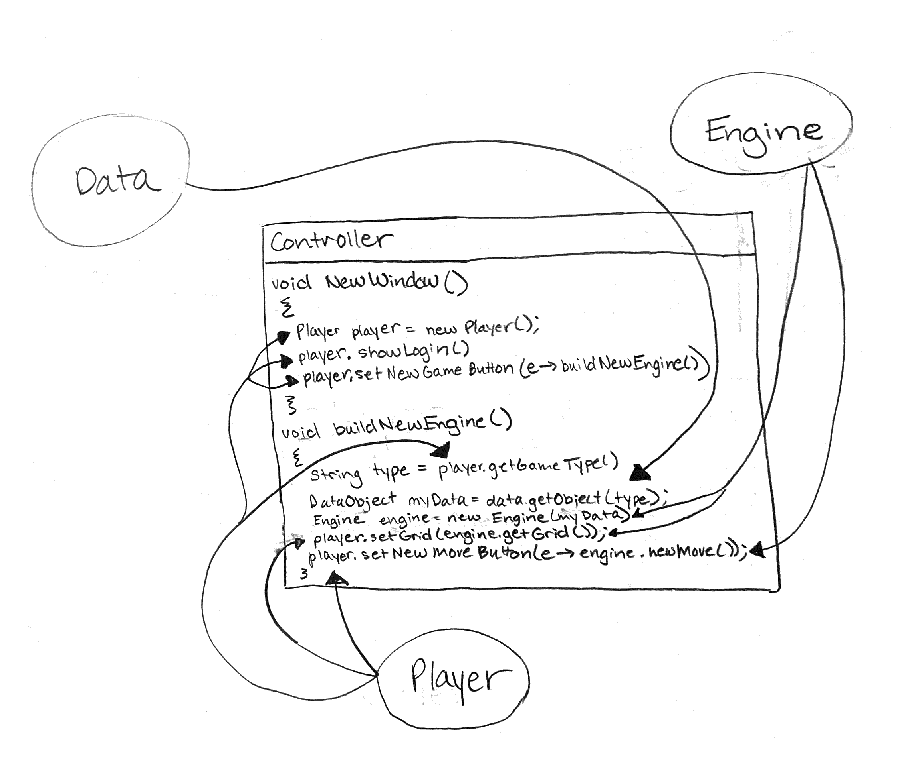
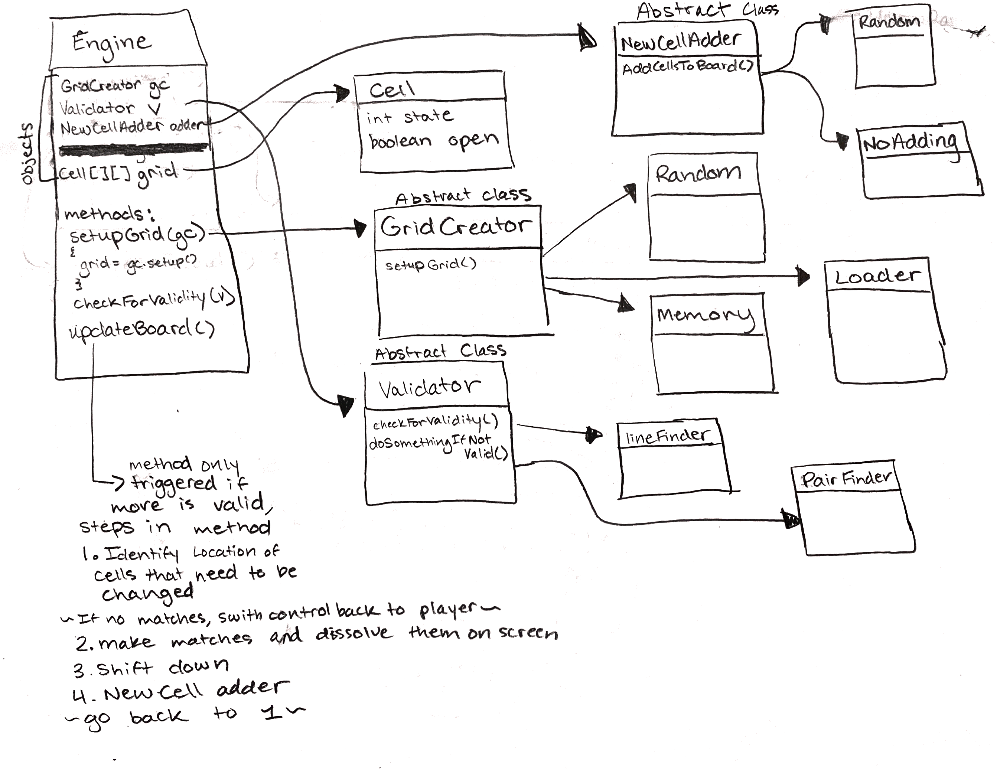
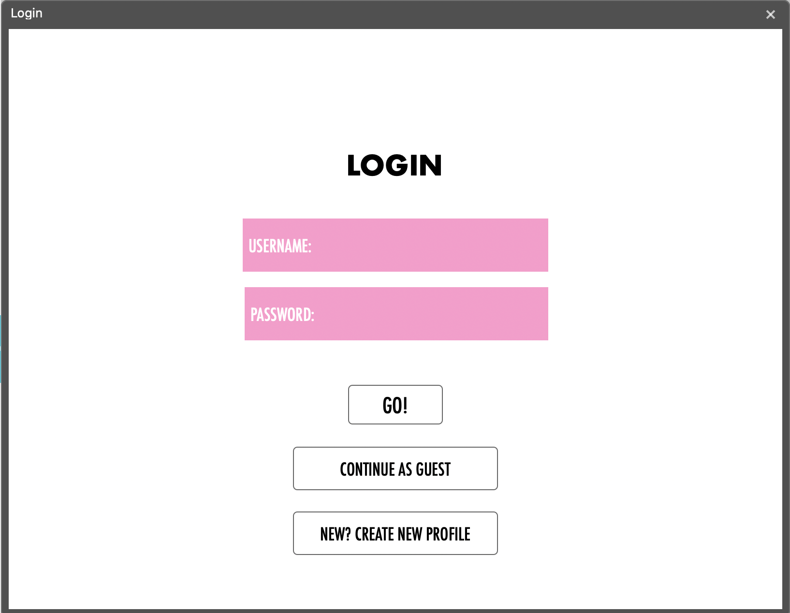
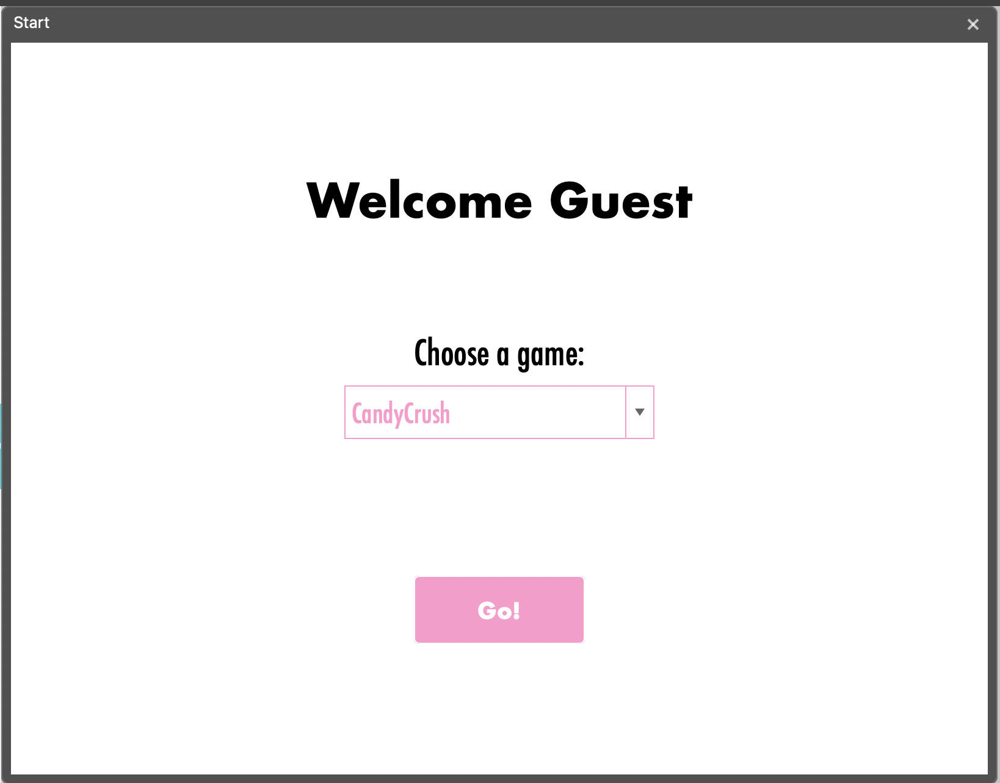
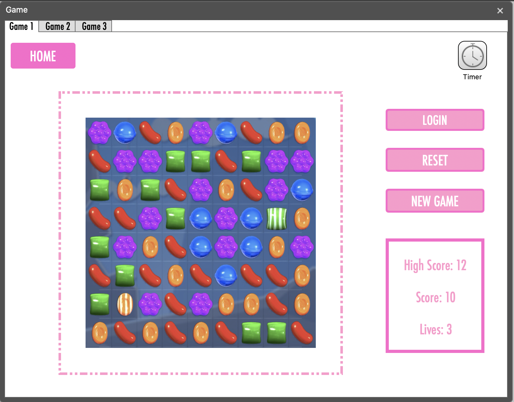

#DESIGN PLAN
## Authors
* Alyssa Shin (as895)
* Juliet Yznaga (jay18)
* Tyler Meier (tkm22)
* Natalie Novitsky (nen4)
* Tanvi Pabby (tp156)

## Introduction
* For this project our team aims to create a program that can accommodate multiple types of games (of a similar design - Grid games), as well as variations of those games. Our code will be flexible enough to work for all of the types and variations of the game, all that will differ are parameters and characteristics that will be set in game-specific configuration files. Our program will be most flexible in the setup of the visuals, and the rules of a game, as that is what is going to differ the most from game to game. Our program will consist of three main parts - Player, Data, and Engine. The Player component of our game is primarily responsible for providing the platform to display the game, and allow the user to interact with the environment. The Data component is responsible for reading in the configuration files, and parsing them, so as to determine what the characteristics of the current game are. The Engine component is primarily responsible for establishing and enforcing the rules of the game, and responding to user input by updating the characteristics/ status of the game, and letting the Player component know what needs to be changed about the display of the game.

## Overview

We decided to split up this project into Player, Engine and Data as reccomended by the project specification. In all of our past projects, we had split up the modules into model, view and controller, but due to the vast amount of detail and functions which are required by each end, we needed to immplement a more encompassing structure. Our view fits within the player modulde, but the player actually has more functions beyond displaying frontend javafx. In order to communicate between these three modules, we intend to use a Controller. This Controller will contain API instances of the Player, Data and Engine and link all communications that need to happen between ends. In this way, none of our module needs to have instances of the others within their code. Below, you can see how the modules communicate between eachother through the Controller. 

* Player: This module will contain the frontend of the program. It will own important elements of a game user interface, such as display of the player score, keep track of how much time has elapsed since the game was started, have interactive buttons (i.e. home button, restart button, etc.). More importantly, it will own an instance of a frontend grid and frontend cells. The controller will connect the backend grid and cells with the frontend grid and cells, such that when the player interacts with the cells, the backend processes the validity of the move and how the grid should update (i.e. more candies dropping into empty spaces from the top, these methods are described in more detail below), and this is reflected in the view.

* Data: This module is responsible for parsing the appropriate information from the game-specific XML files. It loads the appropriate information into an Object and passes it to the Engine. This Object holds the information for the Engine to know the rules of the game and how to set up the grid. It also passes necessary file names to the Player to find CSS style sheets and Image file names.

* Engine: This module is in charge of implementing the rules of the game (by responding to user input), as well as updating the current game grid. Initially, the engine will get configuration information from Data (stuff like how many cells are selected to make a change, how the cells are to be validated, what is supposed to happen if the player makes a 'match' in the game, and how to board is to be updated/ filled in following a match). During the game, the engine waits for user input, checks if the user input is valid, identifies where in the grid there are 'matches'/ cells that need to be changed, and then changes the grid accordingly. The engine also updates the grid after making matches (whether that be filling in the grid, or doing nothing). The engine continues the process of checking for matches and updating the grid until there are no more matches to be made (this only happens if this is the specified way of updating the grid in the config file - for some of the games, once a match is found and the grid is updated, the engine goes back to waiting for user input).  

## Design Details

### Player:
* The data module will specify the inital setup/configuration of the grid and what the game type is. The player module will reference the resource bundle (with a CSS style sheet and a properties file) that corresponds to the game type to access specific information about the game that should be generated (i.e. labels for buttons, color themes, what images should be used for each cell state, sounds to be used in gameplay). 
* The player will communicate with the engine through the controller, and the engine will communicate updates to the player through the controller. 
* Methods:
    * `startGame()`: Enter and start game
    * `displaySplash()`: Show splash screen with the rules for the game
    * `clickCells()`: Records which cells were clicked by player, passes to backend to assess whether it's a valid move or not
    * `goHome()`: In home display, can choose game type (passes this information to backend so that correct XML file can be loaded in)
    * `updateScore()`: Update display of score
    * `updateTime()`: Update display of time since start of game
    * `updateLevel()`: Update display of current level
    * `updateGrid()`: Update grid view
        * Make pairs disappear 
        * If applicable, loads in new images 
    * `animate()`: Moves with animation two images for certain games (i.e. candycrush, bejeweled)
    * `makeView()`: Create new view of game
    * `changeMode()`: Change game mode
* In terms of extensions, the information that this module contains and separating specific details about the view through resource bundles will allow for encapsulation and flexibility for extensions. For example, different CSS style sheets can be created for different modes, so that the only code that would be changed for a different mode would be the name of the sheet that is references. Another example is multiple view. Different instances of player and a corresponsing controller engine can be created for each new view.

### Data: 
* Map from String game type to which XML file to parse for rules/game data
* Back end data (`DataObject`): this is an object built to hold the information that the engine needs to operate. Based on a String game type, the appropriate XML file will be parsed and values like specific subclass name for `Validator`, number of lives/moves/seconds per level, and other game specific data.
* Front end data: `Data` is responsible for parsing the name of the configuration files for the front end from the game-specific XML to pass to `Player`. This will be used for view information like determining the correct CSS style sheet and ResourceBundle to get a map of states to image file names.
* User specific data: Data will be responsible for handling user login (taking a username and password combo input and checking if this exists in an XML file tracking user profiles). This will also handle creating new users and saving and loading game states for each user (initial config files with current scores/levels). 

### Engine: 
* Engine is going to have a `Grid` that is made up of `Cells`. Based on information passed from the frontend about the user interaction with the game, the engine will determine which `Cell`, or `Cell`s have been selected, and will validate this selection/ move using the `Validator`. 
* `Validator` will have different means of validating a move, based on what was specified for the current game in the configuration file. 
* After checking if the proposed movement is valid, then the engine will check the grid to find the places where there are matches - `identifyMatches()` (identify cells that are considered to be matching with thier neighbors). Also, if there are no matches, then the engine returns control to the Player, so that the user can give input again. 
* As long as there are matches, the engine will dissolve these cells - `deleteMatches()`. 
* The the engine will fill in the grid according to how it was specified in the configuration file - `fillGrid()` (this is either going to be filling in the top of the grid, or not adding any cells to the grid at all). 
* Then the engine will go back to `identifyMatches()` to see if this new grid (after adding new cells) has any more matches. If there are no more matches, or if the game type does not add any more cells to the gird (so there is no need to check for new matches), then the engine will give control back to the Player to get a new user input.

### Controller: 

## Example Games
#### Describe three example games that differ significantly in detail. Clearly identify how the functional differences in these games is supported by your design. Use these examples to help clarify the abstractions in your design
- bejeweled endless: this game involves selecting two cells to be switched in order to make matches, and clear cells to get points. When cells are cleared, the cells shift to the bottom of the grid, and new cells are filled in at the top. The goal is to get a target score to advance to the next level.
- bejeweled puzzle: this game involves selecting two cells to be switched in order to make matches, and clear all of the cells on the grid. When cells are cleared, they stay cleared, and the goal is to clear all of the cells from the grid, given a time constraint.
- bejeweled action: this game involves selecting two cells to be switched in order to make matches, and get to a certain number of points in the game, given a time constraint. When cells are cleared, all cells are shifted down, and new cells fill the top rows.
- candy crush with levels: this game involves selecting two cells to be switched in order to make matches, and clear cells to get points. When cells are cleared, the cells shift to the bottom of the grid, and new cells are filled in at the top. The goal of the game is to reach the target score in the correct number of moves.
- minesweeper: the goal of this game is to reveal all of the cells that do not contain bombs without clicking on any of the cells that do contain bombs. Initially, all cells are hidden. Their state can be revealed by clicking on them. State is either a bomb OR the number of bombs in that cell's 8 cell neighborhood. The player has a given number of lives, and the player loses a life when they click a cell with a bomb. They win when all non-bomb cells are clicked; they lose when all lives are lost. If a user clicks on a cell with no bombs in its neighborhood, all neighbors of that cell are revealed. This process is then repeated for all newly opened neighbors until the whole continuous area with no bombs has been revealed.
- [memory game](https://en.wikipedia.org/wiki/Concentration_(card_game)) : this game involves selecting two cells under the assumption that they are a match, and if they are, they are cleared. If they are not, they flip over for a very short period of time and then flip back over so the user cannot see their value. The goal is to finish the game under a time constraint, and without running out of lives.

Memory game and minesweeper share a `Validator` subclass that checks that the selected cells are still hidden (it doesn't make sense to reveal a cell that is already showing in these games). If valid, it reveals the cells and decrements lives if necessary.

Bejeweled variations and Candy Crush share a `Validator` subclass that checks that the selected cells are neighbors and switches the cells if so. Then, it checks whether there is now a "match" on the board (match being the number of consecutive cells of one type needed for this game). If not, it switches the cells back.

Bejeweled variations and Candy Crush then need to update board by removing matched cells and shifting cells down to fill newly emptied slots, then refilling from the top if this is a feature of the game. This process is repeated after every time a match is found until there are no more matches on the grid.

Memory game has no update board functionality and minesweeper repeatedly reveals neighbors of newly opened cells with no neighboring bombs until there are no more cells opened with no neighboring bombs. This can be handled by including a state (0) in minesweeper (and excluding it in memory game) and writing an update board method that seeks out all cells with state 0 that have a revealed neighbor and reveals their neighbors. This way, the update board method will not affect memory game's board.

## Design Considerations
* Design decisions discussed:
    * Having multiple controllers (player to engine, player to data) VERSUS just having one (deals with all connections)
        * PROS of multiple: Splits up the transfer of data more concretely
        * CONS of multiple: have to pass more things between each other, same instance of engine and player in each
        * PROS of one: keeps everything in one place, maybe doesn't have to have excess code that isn't needed
        * CONS of one: longer code, a lot of information in one class
    * What type of data files to be used (XML vs resource bundles)
        * PROS of XML: sets up basically a lot of what is needed and the whole game for you, gives mor einfo in one file
        * CONS of XML: harder for encapsulation, need to change a lot more in here to change specific game
        * PROS of RB: easier for encapsulation and to change some specific things if needed, separates into a more defined set up
        * CONS of RB: may need multiple files for different types of data that is being given
    * What a cell is defined as, how to animate the cells, having possibly two grids (one in the view and one in the backend)
        * Some pros of having two grids is that everything would be updated at the same time, which would limit the amount of information having to travel between the different parts of code (would use binding to do this to updat grids at the same time). Also just having the cells be states and not actually moving would be easier to update, however this would also make the animation harder to do if we want to show the actual cells (images) moving over each other in the grid
    * Having map of states to images in each XML/resource bundle so front end knows what image to display for each state and engine gives us that VERSUS having style sheet/resource bundle that puts image to state based off of given game name
        * PROS of first: we would always know which images to use for which state, could easily have multiple maps for each different game which would make it easier to load, would just have to give a map to player/frontend
        * CONS of first: would have to have a separate map in each XML/data file, more code than needed and a bit duplicated, would be harder to change (less flexible)
        * PROS of second: more flexible and if needed to be changed could just chage the style sheets or the bundle sin front end, would only need to know title of game, keeps logic and code more in the front end, less duplicated code
        * CONS of second: more actual code
    * Game specific subclasses versus splitting up the engine to main things that it does:
        * We talked about how since our game type is grid games and in cell society we used different subclasses for each simulation, it may be easier to have a different subclass ofr each game. However, we realized that this is not what we should be doing, and tried to come up with a better way to separate our engine that made sense and utilized the data files that we would be creating for the differing aspects of each game. We split it up into different steps that the code would go through when a game is played/the player does something. This resulted in our engine being split up into grid and cells (obviously), a new cell adder which adds cells when some disappear due to matches, a player input type which is for the games that deal with a player input and dealing with what it would do, a validator that checks if the move is a valid switch or if the cells clicked was a valid pair, and a cell state changer that changes the cell types based off of what the player has chosen.

